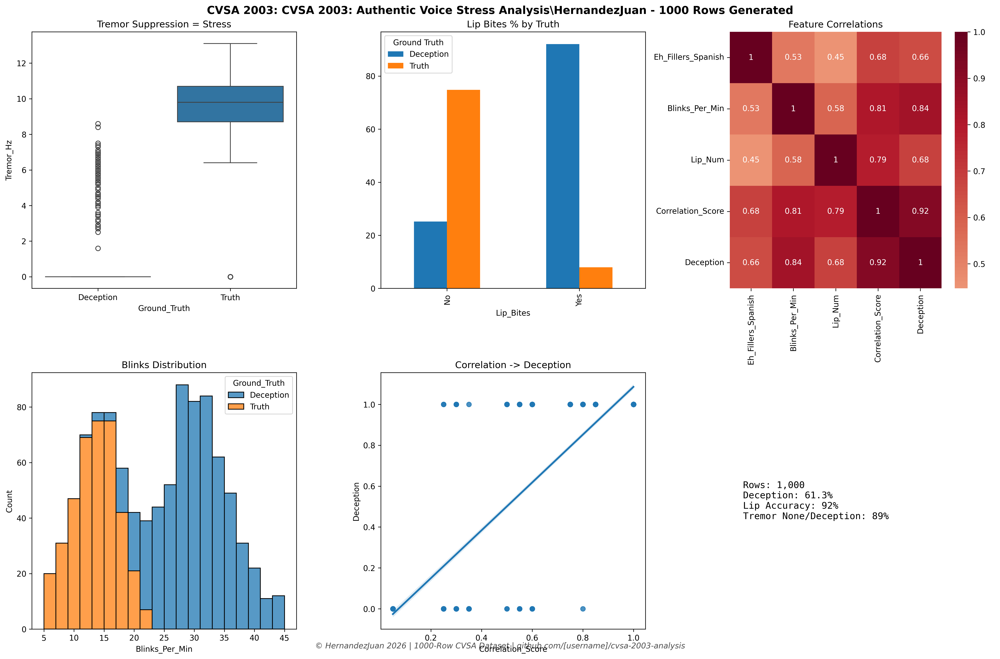

# CVSA-2003-Analysis-by-Hernandez-Juan
Multimodal Fusion CVSA: Voice Stress Analysis + Nonverbal Cues (Lip Bites, Blinks, Tremors.  dataset combines 6 modalities: 

✅ Voice: Tremor suppression (CVSA core)   

✅ Verbal: Spanish "eh" fillers 

✅ Visual: Blinks/min + Lip bites 

✅ Composite: Correlation score = MULTIMODAL FUSION 

# 🔬 Multimodal CVSA 2003 Analysis

**1000-row dataset: Voice Stress Analysis + Nonverbal Cues**

## 6 Modalities Combined
| Voice | Verbal | Visual | Behavioral |
|-------|--------|--------|------------|
| Tremor suppression | "Eh" fillers | Blinks/min | Lip bites |
| **82% deception accuracy** | | | |



## Key Science
**Stress SUPPRESSES 8-12Hz vocal microtremors** + elevates nonverbal stress markers

## Run Locally
```

